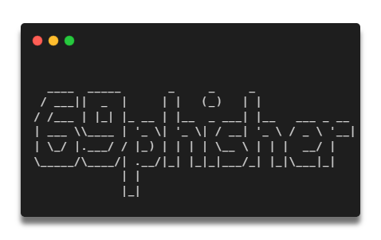

<div align="center">
  <a href="https://github.com/3jd3rh4ck3r/69phisher">
    
  </a>

<h2 align="center">69phisher</h2>

  <p><i>A beginners friendly, Automated phishing tool with 30+ templates.</i></p>
  <p align="center">
    <a href="https://github.com/3jd3rh4ck3r/69phisher/issues/new?assignees=&labels=bug&title=Report Bug">Report Bug</a>
    &nbsp;·&nbsp;
    <a href="https://github.com/3jd3rh4ck3r/69phisher/issues/new?assignees=&labels=&template=feature_request.md&title=">Request Feature</a>
  </p>
  <a href="https://github.com/3jd3rh4ck3r/69phisher/stargazers">
  <a href="https://github.com/3jd3rh4ck3r/69phisher/network"></a>

  <a href="https://github.com/3jd3rh4ck3r/69phisher/issues"></a>
  <a href="https://github.com/3jd3rh4ck3r/69phisher/blob/main/LICENSE"></a>
  <br/>
</div>
<br />


### To do :
Add Browser in the browser mode. Learn more about BITB attack https://www.makeuseof.com/what-is-browser-in-the-browser-attack/ and https://github.com/mrd0x/BITB .
### Features

- Latest and updated login pages.
- Mask URL support 
- Beginners friendly
- Tunneling options
  - Localhost (visit 127.0.0.1:8080)
  - Cloudflared (default and automated)

### Screenshots 
#### Menu

#### Website and login page selection

#### Share the link and grab details


### To do :
Add Browser in the browser mode. Learn more about BITB attack https://www.makeuseof.com/what-is-browser-in-the-browser-attack/ and https://github.com/mrd0x/BITB .
### Features

- Latest and updated login pages.
- Mask URL support 
- Beginners friendly
- Tunneling options
  - Localhost (visit 127.0.0.1:8080)
  - Cloudflared (default and automated)

### Screenshots 
#### Menu

#### Website and login page selection

#### Share the link and grab details


### Installation

##### Just, Clone this repository -
```sh
$ git clone https://github.com/3jd3rh4ck3r/69phisher.git
